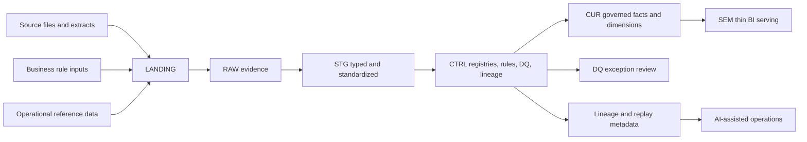

# 03. Target Architecture

The target architecture uses a layered operating model:

```text
LANDING
  -> RAW evidence
  -> STG typed and standardized data
  -> CTRL registries, lifecycle, rules, DQ, lineage
  -> CUR governed facts, dimensions, and bridges
  -> SEM thin BI and semantic serving
```

The layer names are less important than the separation of responsibility.

## Layer Responsibilities

| Layer | Responsibility | What does not belong here |
| --- | --- | --- |
| `LANDING` | Receive files, extracts, and manual-rule inputs. | Business interpretation or correction. |
| `RAW` | Preserve source evidence with ingestion metadata. | KPI logic or report shaping. |
| `STG` | Type, standardize, normalize, and prepare keys. | Cross-domain business rules. |
| `CTRL` | Manage registries, lifecycle, rule history, DQ, lineage, and replay scope. | Presentation-only report formatting. |
| `CUR` | Publish governed facts, dimensions, bridges, and analysis-grade outputs. | Source-specific hacks or hidden procedural logic. |
| `SEM` | Provide thin BI and semantic-serving views. | Primary transformation logic. |

## High-Level Flow



## Architectural Shift

### From

```text
Source files
  -> orchestration
  -> staging reloads
  -> large SQL procedures
  -> warehouse tables
  -> BI logic
```

### To

```text
LANDING
  -> RAW
  -> STG
  -> CTRL
  -> CUR
  -> SEM
```

The redesign makes source behavior, rule application, lifecycle policy, data quality, curated grain, and semantic meaning explicit.

## Role of CTRL

`CTRL` is the operating control layer. It is where the platform tracks:

- file and batch registries;
- schema versions;
- source contract state;
- rule history;
- DQ results;
- lineage events;
- affected recompute windows;
- approved adjustments;
- semantic publication readiness.

This layer makes the platform observable for humans and readable for future AI-assisted operations.

## Curated and Semantic Model

Curated outputs are the system of record for analytical meaning.

They should declare:

- table or view grain;
- natural key and surrogate key strategy;
- source contribution;
- applied rule sets;
- allowed measures and dimensions;
- refresh cadence;
- reconciliation status;
- privacy or access boundary.

The semantic layer stays thin. It exposes business-friendly names, metric definitions, and consumption views, but it does not become the hidden transformation engine.

## Design Conclusion

The target architecture is not a new set of labels for the same process. It changes where responsibilities live:

- evidence stays in `RAW`;
- standardization lives in `STG`;
- control, rules, DQ, and lineage live in `CTRL`;
- business meaning is published in `CUR`;
- BI consumes from `SEM`.

That separation is the foundation for performance, reliability, governance, and AI readiness.
